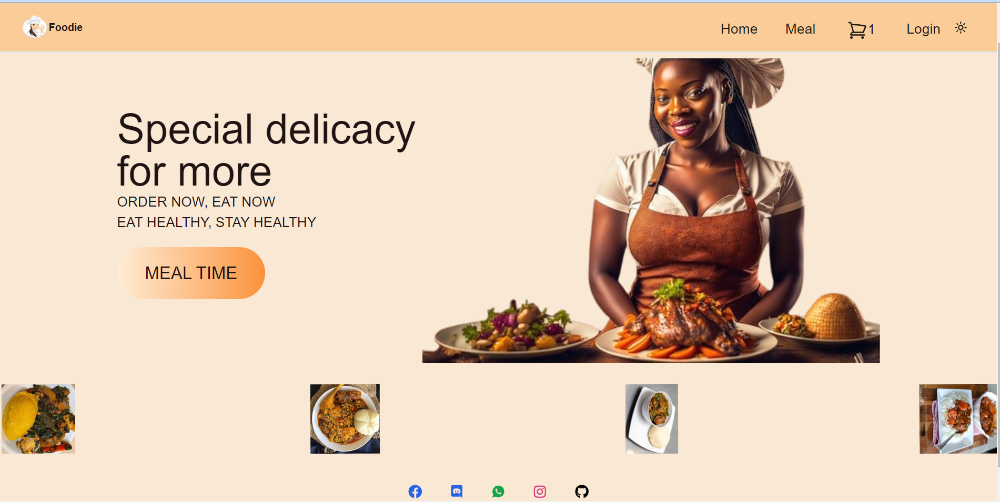
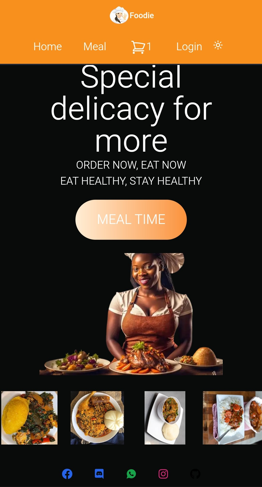
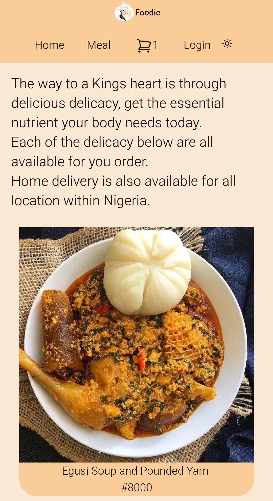
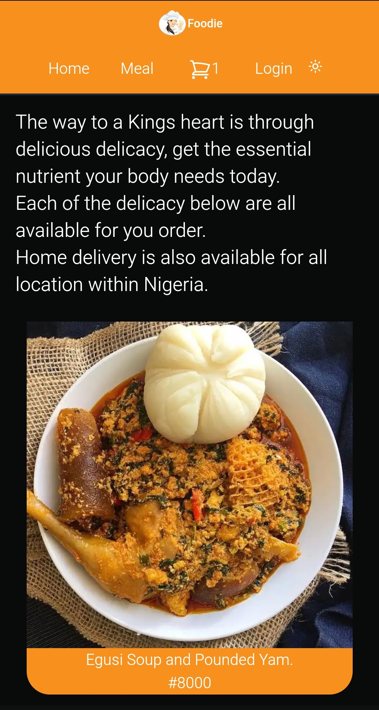
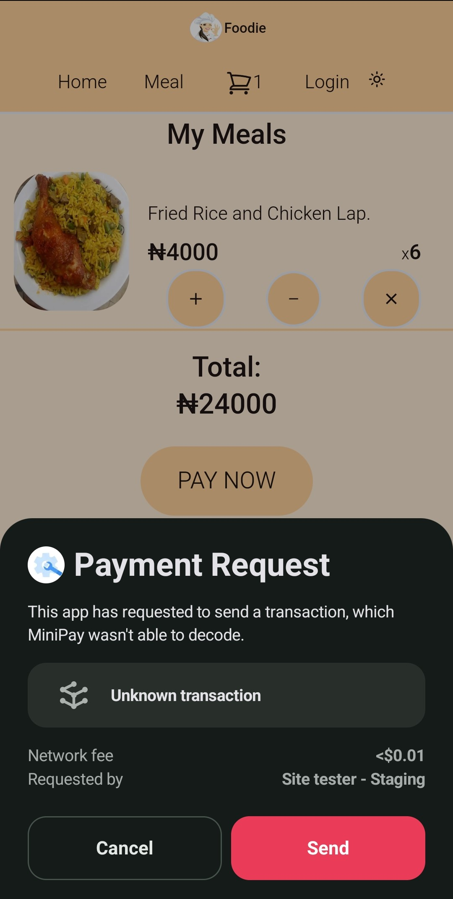
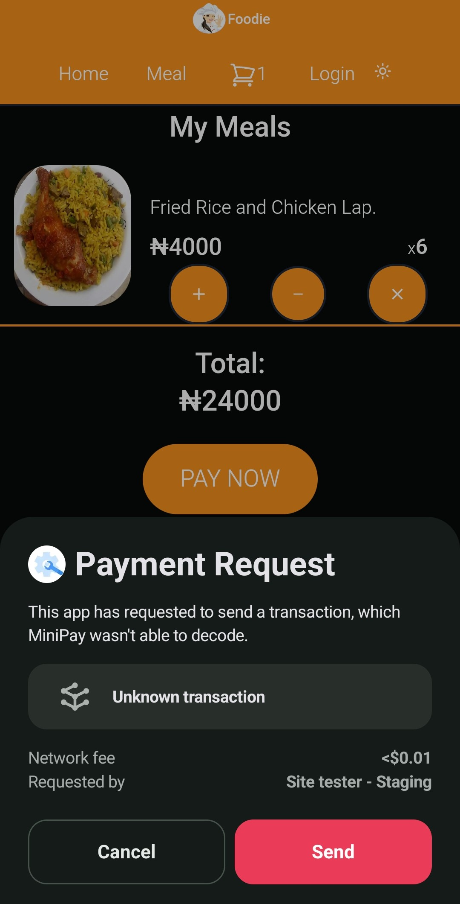

# foodie
This Project is for Celo Hackathon

### Problem

In Nigeria, eating healthy is a major problem for many people. Additionally, the conditions in which food is prepared often present significant issues.

These days, many food vendors do not know the proper nutritional content each meal should contain and often neglect the health of their customers by preparing meals in unhealthy environments. 

Another problem is the inadequate access to food for many customers. Many people do not have access to good food because of the distance where it is sold.

## Solution

Foodie app is dedicated to providing meals with the proper nutritional value each dish should contain. We ensure that all our meals are prepared with the right ingredients in a very clean environment, minimizing the risk of contamination. Additionally, our food is sold online, allowing anyone to place an order from any location. 

## Methodology

This project ensures it consistently delivers high-quality, nutritious meals while providing an exceptional customer experience.

## Description

The Foodie app is designed to make healthy eating easy, convenient, and accessible for everyone. Our app focuses on providing meals that are nutritionally balanced, prepared in a hygienic environment, and available for order from any location through our online platform.

### Short description

The Foodie app is committed to making healthy eating simple and accessible. By focusing on nutrient-rich meals, maintaining high hygiene standards, and providing a seamless online ordering experience which enables the use of Minipay for payment. 

### Road Map
- Addition of delivery management service
- Addition of Admin section to manage orders and delivery
- Additon of Map to enable customers monitor their orders

### How it was made

This project was made using Next.js for the frontend and Zustand for the state management. Connectiing with my smart contract was done using Wagmi, ethers, viem and wallet connect.

### Tools

- Next.js, React, Wagmi, Solidity, Remix, Typescript, ethers, viem.

### Languages

- Typescript, Solidity.

### Frameworks used

- Next.js, Solidity, Wagmi, Zustand, Shadcn, Framer-motion, ethers, viem, radius-ui, @rainbow- me, @celo/rainbowkit-celo, @headlessui/react.

### Instructions

- Clone the repository from github
- Run `npm install` to install all packages
- Run `npm run dev` to start the Next.js server
 
### Screenshots

### Links

- [Github link](https://github.com/Preciousnnebuogor/foodie)
- [Vercel link](https://foodie-ashen-phi.vercel.app/)
- [Video link] (https://www.youtube.com/watch?v=_fMUxrwd6NA)

